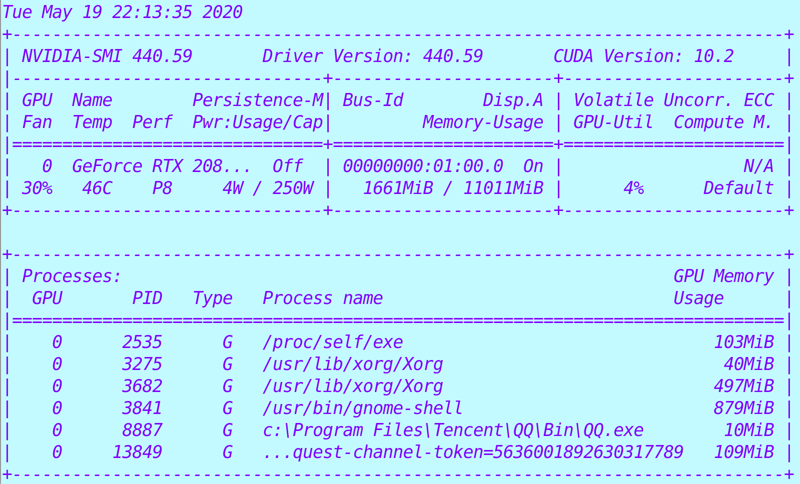

# Read core power consumption

I use a NVIDIA graphic card and I installed the driver from NVIDIA. After installing the NVIDIA driver, there will be a command called ``nvidia-smi`` installed.

The output of ``nvidia-smi`` is something like this.

